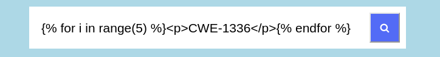
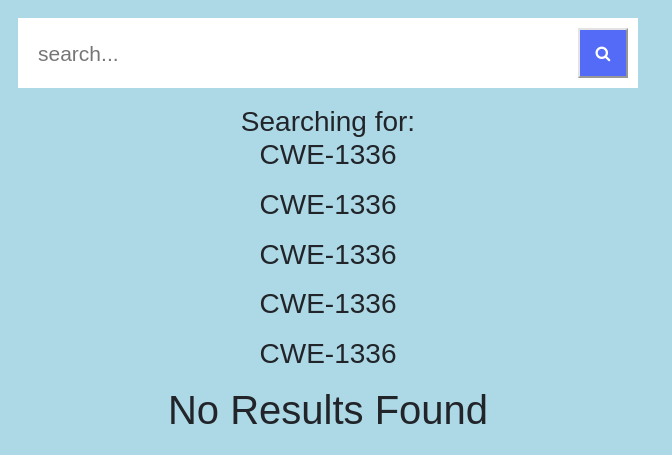
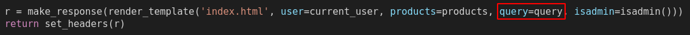
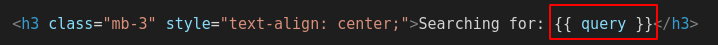

# [CWE-1336: Improper Neutralization of Special Elements Used in a Template Engine](https://cwe.mitre.org/data/definitions/1336.html)

Como foi usado flask para o backend, também foi utilizado *template engine* jinja2. Assim, uma implementação errada pode fazer com que o atacante explore esse fator. O exemplo a seguir mostra como um ataque pode ser feito. O código python é escrito dentro de chavetas, como é usado com o jinja2.

O resultado desta pesquisa seria o seguinte:

Ora, dependendo das variáveis que são passadas para a template, o atacante pode ter acesso a informações críticas:

Neste caso, um objeto user é passado para a template para depois disponibilizar os butões de Reserve, Add ou Remove, conforme o tipo de utilizador. No entanto um atacante pode ir buscar outras informações a esses objetos, como a password.

## Código
Neste caso, a versão vulnerável altera sempre o código fonte do index.html sempre que um request é feito, para adicionar o texto sobre o que o utilizador está a pesquisar.

Onde *query* é o texto que o utilizador envia pela barra de pesquisa. Assim, quando é feito o render_template, o texto que o utilizador enviou vai ser processado também. Se esse texto incluir código que pode ser processado pelo jinja2 está efetuado o ataque. Para corrigir esta vulnerabilidade, o código fonte nunca deve ser alterado desta forma. Se queremos mostrar informação dinâmica ao utilizador, devemos passá-la toda como argumentos no o render_template e usá-la adequadamente no template.

