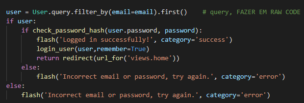

# [CWE-200:  Exposure of Sensitive Information to an Unauthorized Actor](https://cwe.mitre.org/data/definitions/200.html)

Esta vulnerabilidade está presente quando o atacante tentar iniciar sessão numa das contas. Quando erra o email aparece um erro a indicar que o email não existe na base de dados, e quando acerta o email mas erra a password aparece um erro a indicar que a password estava incorreta. Assim, informação valiosa é dada ao atacante.

Exemplo de errar a password:

Exemplo de errar o email:

## Código

A maneira mais fácil de contrariar esta vulnerabilidade é cada vez que o utlizador errar a password ou o email aparecer o mesmo erro, neste caso a dizer que "errou a password ou o email", de maneira a não dar extra informação ao utilizador.

### Versão vulnerável

### Versão Segura

