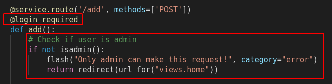

# [CWE-862: Missing Authorization](https://cwe.mitre.org/data/definitions/862.html)

Esta vulnerabilidade está presente no sistema de aumento, redução e remoção de produtos. Idealmente, apenas o admin devia poder efetuar essas operações. No entanto qualquer atacante pode efetuar um GET request com o id de um produto, para /remove?id=## ou /add?id=##, e reduzir, aumentar ou remover (um produto é removido quando a sua quantidade está a 0, e se volta a efetuar o pedido de redução).
Com esta vulnerabilidade presente podiamos executar um simples script como o seguinte para reduzir a quantidade dos produtos com id's entre o 1 e o 1000 em 100 elementos (ou removê-los da base de dados, caso a quantidade fosse menor a 100).
```python3
#!/usr/bin/env python3
import requests
for i in range(1,1000):
    [requests.get(f'http://127.0.0.1:5000/remove?id={i}') for j in range(100)]
```

## Código
Na imagem a seguir vemos versão segura do código que faz a verificação do utilizador. É usado um decorator da biblioteca flask_login, @login_required, que apenas permite os utilizadores autenticados de fazer pedidos naquela route. Depois, neste caso, verifica-se se o utilizador é admin, pois apenas a ele queremos dar esse previlégio. Por uma questão de simplicidade de implementação, apenas o utilizador com o id igual a 1 é considerado admin. Na versão vulnerável, este código é omitido.

