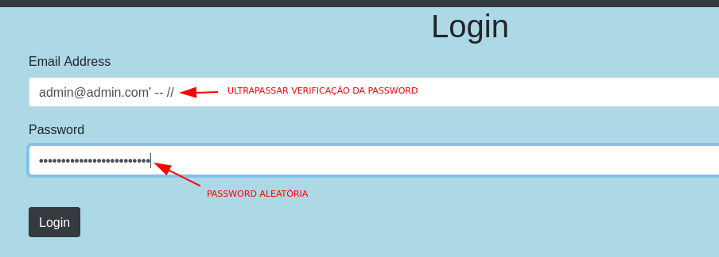
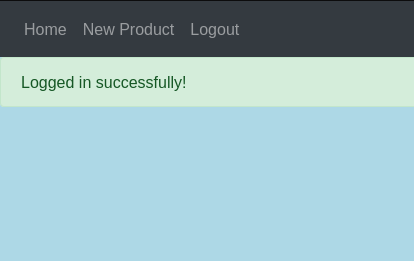
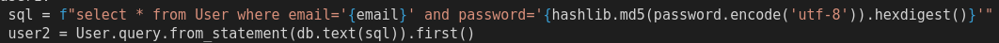
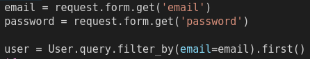

# [CWE-89: Improper Neutralization of Special Elements used in an SQL Command ('SQL Injection')](https://cwe.mitre.org/data/definitions/89.html)
Esta vulnerabilidade está presente no sistema de login. Como a verificação do input do utilizador não é feita, um atacante pode autenticar-se em qualquer conta existente sem saber as credenciais.

O resultado é o seguinte:

## Código
Como podemos ver a seguir, o acesso à base de dados está a ser feito executando diretamente o comando sql. Como não é feita nenhuma verificação aos inputs do utilizador, a vulnerabilidade está presente.

A forma usada para corrigir esta vulnerabilidade foi usar as funções disponibilizadas pelo flask-sqlalchemy, como add, remove e filter_by, para evitar más implementações do código sql.

