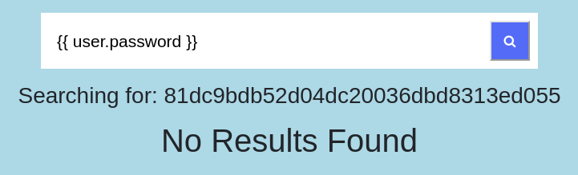
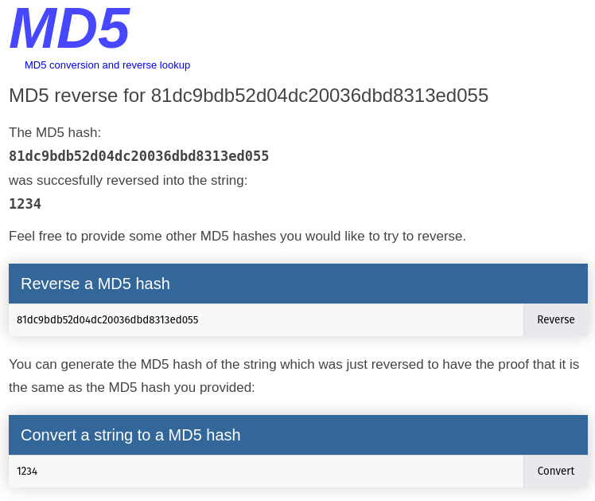
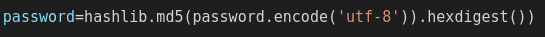
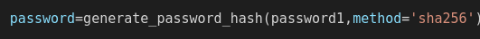

# [CWE-328: Use of Weak Hash](https://cwe.mitre.org/data/definitions/328.html)

Esta vulnerabilidade está presente no backend, quando é usado uma função de hash que é considerada insegura. Neste caso é usado md5, o que significa que se o atacante conseguir obter o resultado da função de hash, seja através de sqlinjection seja através de outro método, com uma simples pesquisa no google consegue descobrir a password original que foi usada para gerar aquele código hash. No exemplo a seguir, um atacante obteve o hash da password de um utilizador através da vulnerabilidade CWE-1336, explicado no outro ficheiro, depois de ter acedido com a conta desse utilizador pela vulnerabilidade CWE-89.

Com uma simples pesquisa, o atacante obteve a password do utilizador.

## Código

O código por detrás é simples, na versão vulnerável usou-se md5 como função de hash, e na versão segura foi usado sha256.

