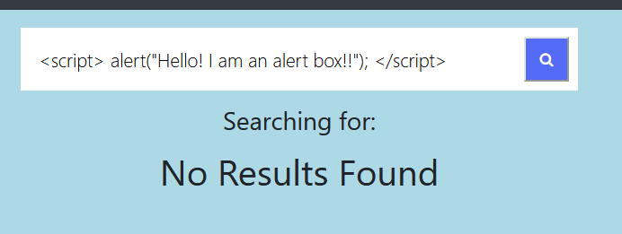
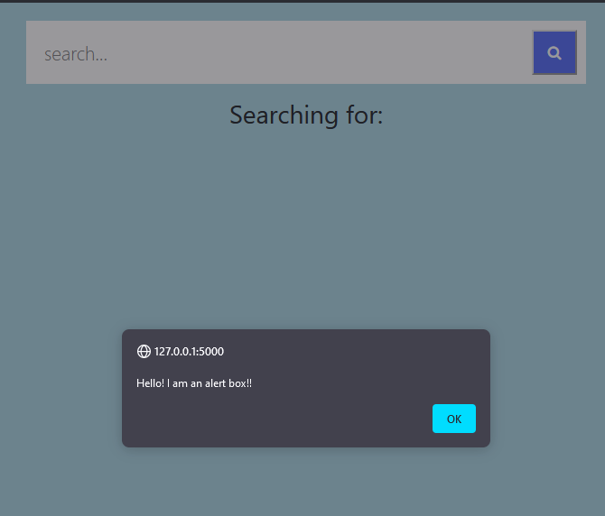
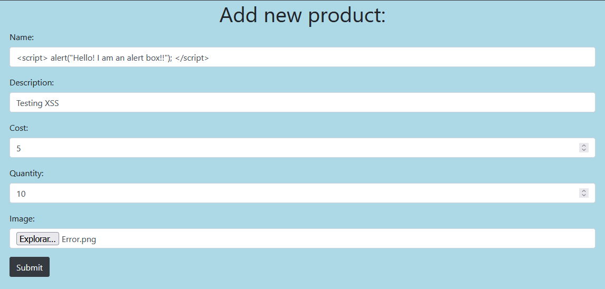
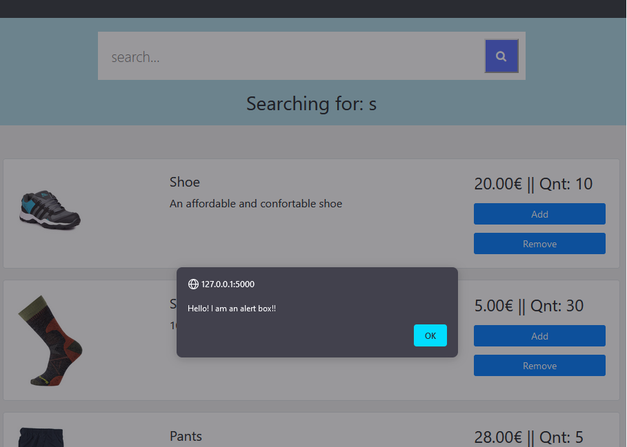
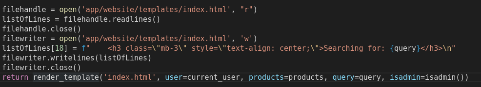
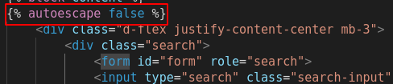
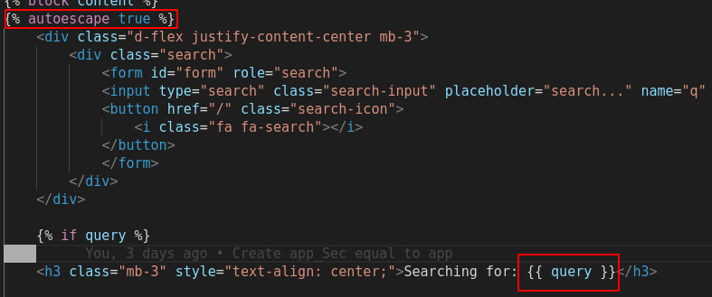
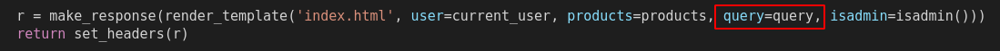

# [CWE-79: Improper Neutralization of Input During Web Page Generation ('Cross-site Scripting')](https://cwe.mitre.org/data/definitions/79.html)
Esta vulnerabilidade está presente como reflected XSS no sistema de pesquisa de produtos, e como stored XSS no sistema de adicionar novos produtos. Como não é feita a verificação dos inputs, pode ser adicionado código perigoso. A seguir estão os exemplos de cada um:

### Reflected XSS:

O resultado é o seguinte:

### Stored XSS:

O resultado é o seguinte:

## Código
No caso do reflected xss, como na versão vulnerável o código fonte do index.html é alterado cada vez que é efetuado um pedido, o que é escrito na caixa de texto é adicionado diretamente ao index.html sem verificação. Assim, como não há verificação, pode ser adicionado código perigoso.

No caso do stored xss, a flag ** foi colocada no index.html, logo o texto processado pelo jinja2 não vai substituir os caracteres perigosos, levantando a possibilidade para essa vulnerabilidade.

Na versão segura, todo o texto é passado como argumento para o jinja2 processar. Como colocámos a flag **, todo o tipo de caracteres perigosos vão ser substituidos, não podendo assim adicionar código de risco.

